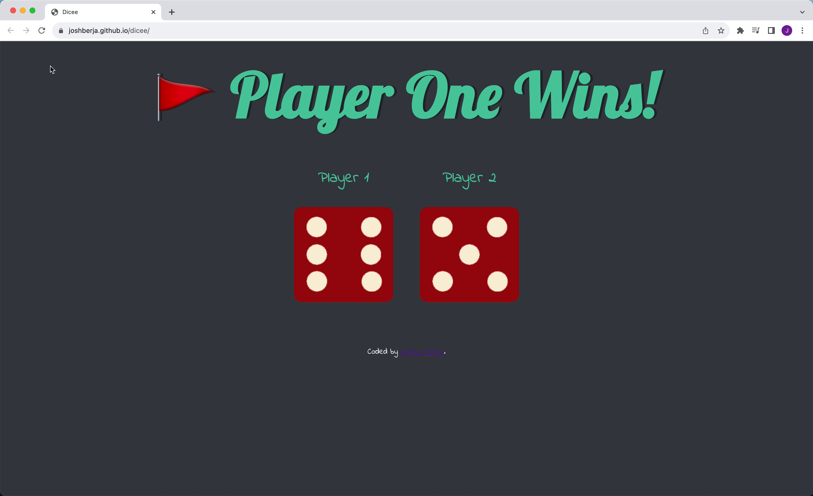

# Dicee

## Table of contents

- [Overview](#overview)
  - [Demo](#demo)
  - [Links](#links)
- [My process](#my-process)
  - [Built with](#built-with)
- [Author](#author)

## Overview

Dicee game. Roll the dice by refreshing the page. This project focuses on manipulating the Document Object Model (DOM) with JavaScript.

### Demo

### Links

- Live Site URL: [Dicee](https://joshberja.github.io/dicee/)
- YouTube Video Demo: [Dicee YouTube Video Demo](https://youtu.be/t0lQoD-INCU)

## My process

### Built with

- HTML
- CSS
- JavaScript

## Author

- GitHub - [joshberja](https://github.com/joshberja)
- LinkedIn - [Joshua Berja](https://www.linkedin.com/in/joshuaberja/)